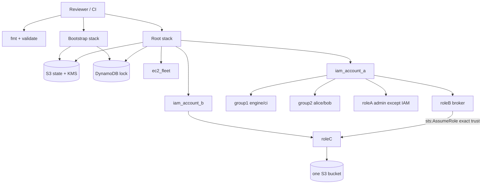
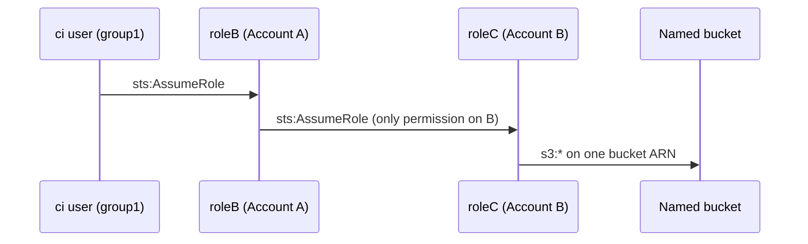
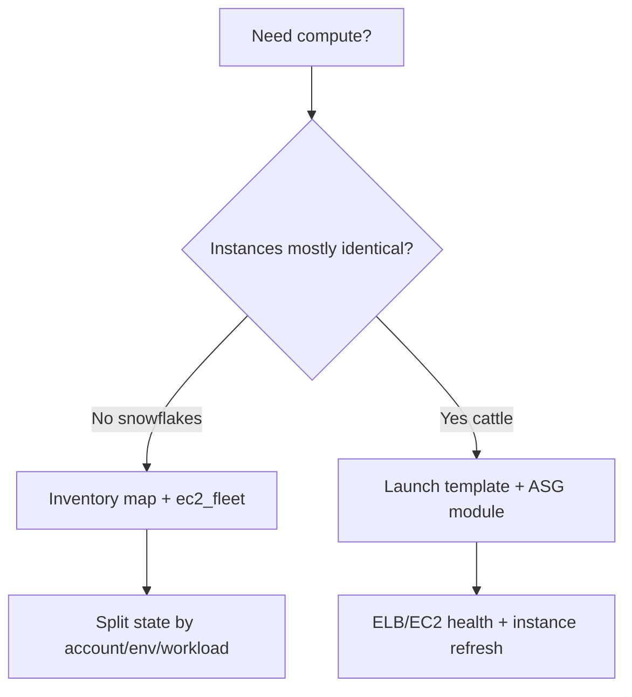

# Architecture

Architect view of the assignment as one multi-account (or single-account reviewer) system.

**Run it:** see [`REVIEWER.md`](../REVIEWER.md) — offline validate, sandbox-up, or full remote-state path.

## High-level control / data plane

## Identity path

Trusting Account A root instead of `roleB` would let any sufficiently privileged principal in A become a cross-account actor. Exact ARN trust keeps the broker explicit.

## Scale decision tree

## Reviewer vs production topology

| Concern | Reviewer default | Production target |
|---------|------------------|-------------------|
| Accounts | Caller account for A and B | Separate A/B (+ org OU) |
| Credentials | Ambient AWS creds | Assume deploy roles / OIDC |
| Humans | IAM users (assignment) | Identity Center |
| CI | IAM user policy (assignment) | OIDC → role |
| State | Optional local or one S3 key | Per-account/env keys |
| Compute | Optional cheap inventory | ASG/ECS for app tiers |
